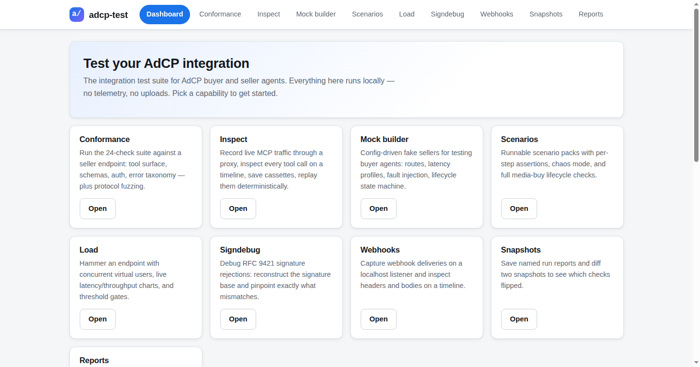
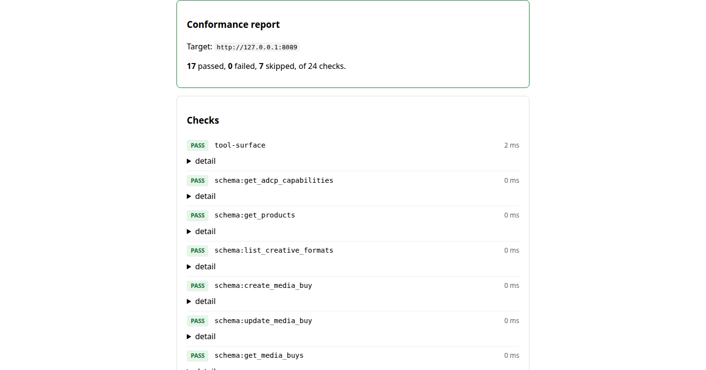

# adcp-test

**v0.1 — launched.** The integration test suite for AdCP. One local web app that answers **"does my AdCP implementation actually work?"** — for buyer agents and seller agents.

## What v0.1 ships

- **Conformance** — functional pass/fail of a seller endpoint: tool surface, input schemas, auth behavior, error codes (24 checks; headless `--ci` for CI pipelines)
- **Inspect** — session timeline debugger with inline schema checks
- **Record / replay** — cassettes for deterministic buyer tests
- **Mock builder** — config-driven mock seller services (request matching, response sequences, latency profiles, fault injection, lifecycle state machines), with record mode that generates configs from real traffic
- **Scenarios** — scripted end-to-end buying scenarios as runnable cards, with chaos mode
- **Load** — concurrent sessions, live latency/throughput charts, CI thresholds
- **Signing debugger** — paste a signed request + key; reconstructs the RFC 9421 signature base, verifies, and pinpoints the mismatch
- **Lifecycle checks** — create → activate → pause → resume → cancel, plus the illegal cancelled → active transition
- **Protocol fuzzer** — malformed / truncated / oversized JSON-RPC payloads with crash and hang detection
- **Webhook listener** — localhost capture timeline for seller callbacks
- **Snapshots** — named report snapshots with pass/fail diffs for regression tracking
- **Evidence reports** — self-contained HTML evidence packs (+ PDF export) assembled from run reports

UI-first: a single Go binary serves the app on localhost. Everything runs
on your machine — **no telemetry, no uploads, no accounts, ever.**




## Install

Requirements: Go 1.27+.

```sh
git clone https://github.com/sujanchalla0510/adcp-test.git
cd adcp-test
go build -o adcp-test ./cmd/adcp-test
./adcp-test            # serves the UI on http://127.0.0.1:18742
```

Or run without building: `go run ./cmd/adcp-test`.

## UI quickstart

1. **Dashboard** — milestone status and API surface overview.
2. **Conformance** — enter a seller's MCP endpoint URL, run the 24-check
   suite, drill into failures.
3. **Scenarios** — pick a pack card, set the target, run; tick **chaos
   mode** to inject faults (the seed in the report replays the run).
4. **Load** — configure concurrency/ramp/duration, watch live charts,
   check CI thresholds.
5. **Signdebug** — paste request + key, verify the RFC 9421 signature.
6. **Webhooks** — start the localhost listener, point the seller at the
   printed URL, watch deliveries land.
7. **Snapshots** — save named reports; diff two snapshots to spot
   regressions.
8. **Reports** — assemble an HTML/PDF evidence pack from run reports.

A full copy-paste walkthrough against a synthetic mock seller lives in
[examples/README.md](examples/README.md): start mock → conformance →
scenario → evidence report.

## Vision

Integrating AdCP means implementing ~13 MCP tools plus RFC 9421 request signing, schema compliance across fast-moving spec versions, and multi-step workflows (products → media buy → creatives → delivery). Today every implementer hand-rolls their own testing: curl scripts, SDK fixture mocks, manual sessions against the public test agent. adcp-test is the shared harness:

- **Conformance** — functional pass/fail of a seller endpoint: tool surface, schemas, auth behavior, error codes
- **Inspect** — session timeline debugger with inline schema checks
- **Record / replay** — cassettes for deterministic buyer tests
- **Mock builder** — config-driven mock seller services (request matching, response sequences, latency profiles, fault injection, lifecycle state machines), with record mode that generates configs from real traffic
- **Scenarios** — scripted end-to-end buying scenarios as runnable cards
- **Load** — concurrent sessions, live latency/throughput charts, CI thresholds
- **Plus** — signing debugger, lifecycle checks, fuzzing, chaos mode, webhook testing, regression snapshots, report exports

UI-first: a single Go binary serves the app on localhost. A headless `--ci` mode exists for CI pipelines only.

## Principles

- **Local-first.** No telemetry, no uploads, ever. Test traffic stays on your machine.
- **Synthetic fixtures only.** Never commit real integration data, credentials, or secrets.
- **Functional, not a linter.** Conformance is pass/fail on behavior, not style grading.

## Status

v0.1 shipped: M1 scaffold → M2 conformance core → M3 inspect + record/replay →
M4 mock builder → M5 scenarios + load → M6 polish + launch (signing debugger,
lifecycle, fuzzing, chaos, webhooks, snapshots, reports). Next: M7 GitHub
Action, MCP server, spec-upgrade diffs.

Public repository: https://github.com/sujanchalla0510/adcp-test

## Run it

```sh
go build -o adcp-test ./cmd/adcp-test
./adcp-test            # serves the UI on http://127.0.0.1:18742
./adcp-test --port 8080
./adcp-test --ci --target https://seller.example/mcp  # headless conformance: JSON report on stdout, exit 0 when all checks pass, 1 otherwise
```

### Conformance

`--ci --target <url>` (or the Conformance screen, or `POST /api/conformance/run`
with `{"target_url": ...}`) runs the suite against a seller agent's MCP
endpoint and produces a machine-readable report:

```json
{
  "target_url": "https://seller.example/mcp",
  "started_at": "2026-09-28T...",
  "finished_at": "2026-09-28T...",
  "summary": { "total": 24, "passed": 24, "failed": 0, "skipped": 0 },
  "checks": [
    { "name": "tool-surface", "status": "pass", "detail": "...", "duration_ms": 12.3 },
    { "name": "schema:get_products", "status": "pass", "detail": "...", "duration_ms": 0.1 },
    { "name": "auth:unsigned-mutating-call-rejected", "status": "pass", "detail": "...", "duration_ms": 8.7 }
  ]
}
```

Check families: `tool-surface` (expected AdCP tool surface from `tools/list`),
`schema:<tool>` (declared inputSchema well-formedness + expected required
fields), `auth:*` (unsigned / malformed-signature mutating probes must be
rejected; read-only behavior documented), `errors:*` (unknown tool and
invalid args must return structured JSON-RPC errors, not HTML/plaintext).

### Inspect + record/replay

The Inspect screen records live MCP traffic and replays it deterministically:

- **Session timeline** — every proxied tool call appears as an OUT/IN step
  pair with pretty-printed request/response payloads, timing, errors, and
  per-tool argument-validation badges (same expectations as the
  conformance schema checks).
- **Recording proxy** — `POST /api/record/start {"upstream_url": ...}`
  returns a proxy URL + session ID; point a buyer at the proxy (header
  `X-Session-ID: <id>` pins traffic to the session), then
  `POST /api/record/stop {"session_id": ...}` saves a cassette under
  `./cassettes/`. Recording is secret-safe: auth/signature headers and
  token-like fields are redacted at capture time.
- **Cassettes** — versioned JSON: `{version, target, recorded_at,
  exchanges: [{method, tool, recorded_at, arguments, response, error?,
  duration_ms}]}`. Request IDs are not stored (they vary per run).
- **Replay server** — serves a cassette as a fake MCP endpoint, rewriting
  the recorded response's `id` to the incoming request's. Lenient mode
  (default): recorded arguments must be a subset of the incoming call's,
  falling back to the first exchange for the same tool; unmatched calls
  get a structured JSON-RPC error (`-32000`). `--strict` requires
  deep-equal arguments and fails closed instead.

CLI equivalents (no UI needed):

```sh
./adcp-test record --upstream https://seller.example/mcp --out session.cassette.json
# point your buyer at the printed proxy URL; Ctrl-C writes the cassette
./adcp-test replay --cassette session.cassette.json --port 18743 [--strict]
# fake seller on http://127.0.0.1:18743; Ctrl-C stops
```

### Scenarios

Scenario packs are YAML files describing ordered, assertion-checked
tool-call flows against a seller (real, mock, or replay URL). Each
scenario has steps with per-step assertions plus optional setup/teardown
hooks:

```yaml
name: happy-path-media-buy
description: Full media buy lifecycle.
scenarios:
  - name: display media buy
    steps:
      - name: list products
        tool: get_products
        arguments: {}
        assertions:
          - status: ok
          - latency_ms_lt: 2000
          - response_contains:
              products:
                - product_id: prod-web-banner
      - name: create media buy
        tool: create_media_buy
        arguments: {product_id: prod-web-banner, budget_micros: 5000000}
        save: {media_buy_id: media_buy_id}   # extract into {{vars.media_buy_id}}
        assertions:
          - status: ok
          - response_contains: {status: draft}
      - name: sync creative
        tool: sync_creatives
        arguments:
          media_buy_id: "{{vars.media_buy_id}}"   # chained from the save above
          creative: {format: display, width: 300, height: 250}
        assertions:
          - status: ok
          - response_contains: {status: approved}
```

Assertion kinds: `status: ok|error`, `response_contains: {...}` (recursive
subset match on the result JSON), `latency_ms_lt: N` (milliseconds),
`error_code: N` (JSON-RPC error code). Steps run sequentially; every call
is recorded into a session (visible on the Inspect screen). A step's
`save` map extracts values from its result into `{{vars.*}}` for later
steps; setup/teardown hooks run without assertions (teardown is
best-effort and skips hooks whose variables were never set).

Four built-in packs ship as runnable cards on the Scenarios screen
(synthetic data only): `happy-path-media-buy` (products → create →
sync creatives → delivery), `creative-rejection` (banned creative
rejected, clean creative approved), `cancel-pause` (active → paused →
cancelled, plus an illegal transition asserting `error_code: -32001`),
`budget-limit` (over-limit budget rejected, valid budget creates a draft).

CLI:

```sh
./adcp-test scenario --list
./adcp-test scenario --pack happy-path-media-buy --target https://seller.example/mcp
# --pack also accepts a path to your own pack YAML file
# JSON report on stdout; exit 0 when every scenario passes, 1 otherwise
```

API: `GET /api/scenarios` lists the built-in packs;
`POST /api/scenarios/run {"pack": ..., "target_url": ...}` streams
server-sent events (`scenario_started`, `step_started`, `step_finished`,
`scenario_finished`, then a final `report` event).

### Load

The load engine hammers a seller endpoint with N concurrent virtual
users, each repeating one tool call or a whole scenario pack, with a
linear ramp-up and a duration or total-iteration stop condition. Live
progress (requests, rps, p50/p99, errors, timeouts) streams to the Load
screen's canvas charts; the final report carries p50/p95/p99 latency,
throughput, error/timeout rates, and CI threshold verdicts.

```yaml
# load.yaml
target_url: http://127.0.0.1:8080
tool: get_products
arguments: {}
concurrency: 20
ramp_up: 30s
duration: 60s
# iterations: 1000        # alternative stop condition
request_timeout: 10s
thresholds:
  p99_ms_lt: 2000
  error_rate_lt: 0.01
  timeout_rate_lt: 0.01
```

```sh
./adcp-test load --config load.yaml
# JSON report on stdout; exit 0 when every threshold passes, 1 otherwise
# --target / --concurrency / --duration / --iterations override the config
```

Safety: non-localhost targets are refused unless you pass
`--allow-remote` (or `allow_remote: true` in the config / API body), so a
typo can't turn a load test into an accidental production hammering.

API: `GET /api/load/presets` (smoke / ramp / soak starters);
`POST /api/load/run` with either `{"config_yaml": "..."}` or structured
fields streams `progress` events then a final `result` event
`{"id": ..., "result": ...}`; `GET /api/load/results/{id}` retrieves a
finished run's report.

### Signing debugger

Paste a signed HTTP request and the verification key: the debugger
reconstructs the RFC 9421 signature base from the covered components,
verifies the signature (Ed25519, ECDSA, RSA, HMAC), and pinpoints exactly
what mismatches — wrong key, tampered body (content-digest), expired
`created`/`expires`, or a base that differs from what your signer computed
(paste it as "expected base" for a line-by-line diff).

```sh
./adcp-test signdebug --request req.json --key key.pem [--expected-base base.txt]
```

`req.json`: `{"method": "POST", "url": "...", "headers": {...}, "body": "..."}`.
API: `POST /api/signdebug/verify`.

**Key safety:** the key is used in memory for that one verification only.
It is never stored, logged, recorded into sessions, or included in reports —
the UI clears the key field the moment the check completes.

### Lifecycle checks

Walk one media buy through create → activate → pause → resume → cancel,
then verify the illegal cancelled → active transition is rejected with a
structured JSON-RPC error (`-32001`).

```sh
./adcp-test lifecycle --target https://seller.example/mcp [--bearer-token T]
```

JSON report on stdout; exit 0 when every check passes. A built-in
`lifecycle` scenario pack runs the same flow with per-step assertions.
API: `POST /api/lifecycle/run`.

### Protocol fuzzer

Throw malformed, truncated, deeply nested, oversized, batched, mistyped,
and unknown-method JSON-RPC payloads at the endpoint and record crashes,
hangs, non-JSON responses, and transport errors. Generation is seeded:
the report records the seed, so any run replays exactly.

```sh
./adcp-test fuzz --target http://127.0.0.1:8089 --iterations 200 [--seed 42]
```

**Safety:** fuzzing targets localhost only. Non-localhost targets are
refused unless you pass `--allow-remote`. API: `POST /api/fuzz/run`.

### Chaos mode

Every scenario run can inject seeded, reproducible chaos: dropped tool
calls and latency spikes. Steps that were injected are badged ⚡ in the
report, and the report records the seed plus configured rates, so the
exact fault pattern replays.

```sh
./adcp-test scenario --pack happy-path-media-buy \
    --target http://127.0.0.1:8089 --chaos --chaos-seed 42
```

Same localhost guard as load/fuzz: remote targets are refused unless
explicitly allowed. API: `POST /api/scenarios/run` with
`{"chaos": true, "chaos_seed": 42}`.

### Webhook listener

Start a localhost-only listener, point the seller's webhook configuration
at the printed URL, and watch deliveries land on an ordered timeline with
pretty-printed bodies. Authorization-style headers are redacted at
capture; bodies can be truncated.

```sh
./adcp-test webhook-listen --port 8090 [--out deliveries.json]
```

API: `POST /api/webhooks/listen`, `GET /api/webhooks/deliveries`,
`POST /api/webhooks/clear`, `POST /api/webhooks/stop`.

### Snapshots

Save named JSON reports (conformance, scenario, load, lifecycle, fuzz)
under `./snapshots/` and diff two snapshots to see which checks flipped
pass → fail, fail → pass, new, or removed — the regression-tracking
workflow.

```sh
./adcp-test snapshot save --kind conformance --name baseline --file conformance.json
./adcp-test snapshot diff --before baseline --after candidate
./adcp-test snapshot delete --name old-baseline
```

API: `GET /api/snapshots`, `POST /api/snapshots/save`,
`GET /api/snapshots/diff?before=&after=`, `POST /api/snapshots/delete`.

### Evidence reports

Assemble a self-contained evidence pack from run reports: an HTML bundle
with inline CSS (no external requests), plus an optional PDF export.
Include a snapshot diff section for before/after evidence.

```sh
./adcp-test report --conformance c.json --scenarios s.json --load l.json \
    --lifecycle lc.json --fuzz f.json --diff-before baseline --diff-after candidate \
    --title "Seller A — integration evidence" \
    --out evidence.html --pdf evidence.pdf
```

Any input may be omitted. API: `POST /api/reports/build` with
`"format": "html"|"pdf"` returns the pack as a download.

### Worked example

A complete copy-paste flow against a synthetic mock seller (all fixtures
invented for testing — no real sellers, no real money):

```sh
./adcp-test mock --config examples/mock-seller.yaml   # terminal 1: mock on 127.0.0.1:8089
./adcp-test --ci --target http://127.0.0.1:8089 > conformance.json
./adcp-test scenario --pack happy-path-media-buy --target http://127.0.0.1:8089 > scenario.json
./adcp-test report --conformance conformance.json --scenarios scenario.json \
    --out evidence.html --pdf evidence.pdf
```

See [examples/README.md](examples/README.md) for the annotated version,
including the web-UI equivalent.

## License

Apache-2.0. See [LICENSE](LICENSE).
