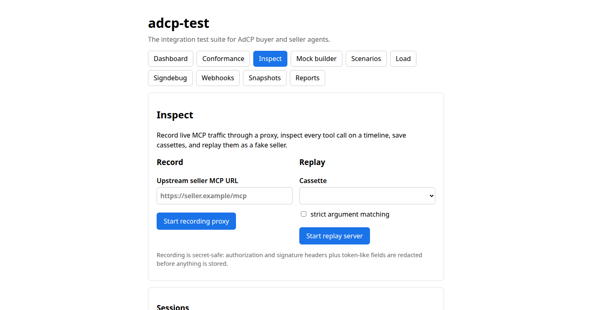
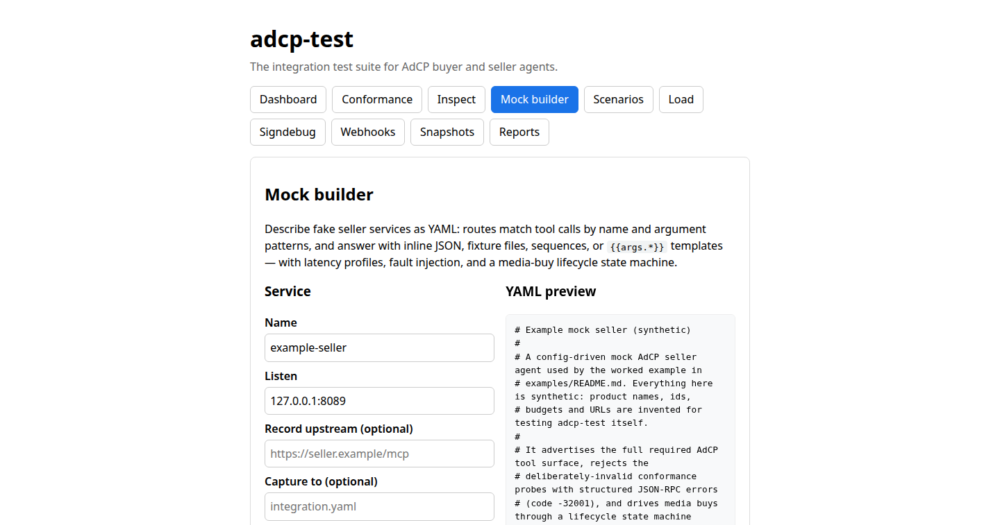
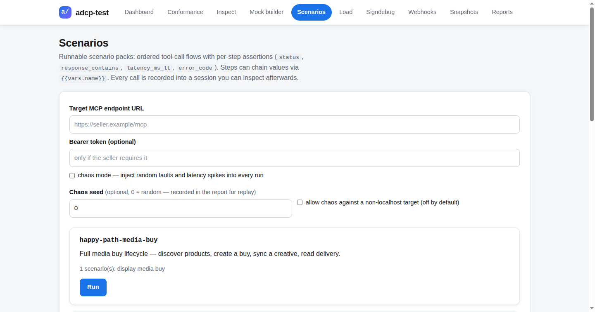
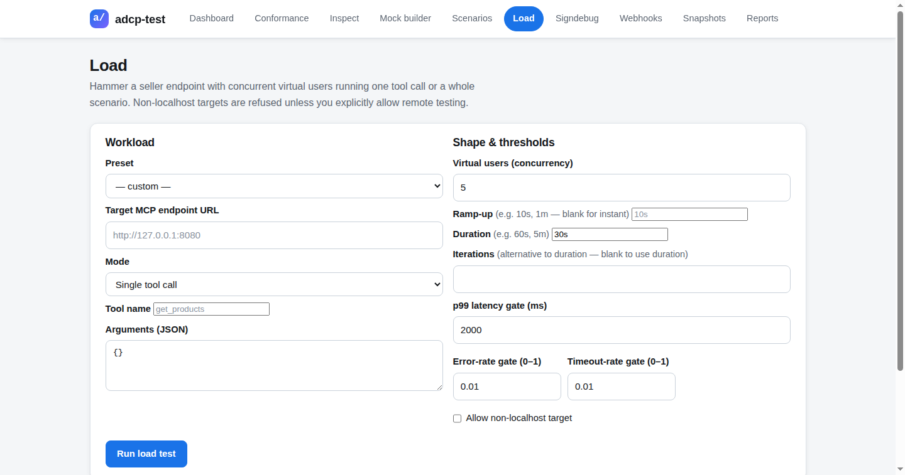
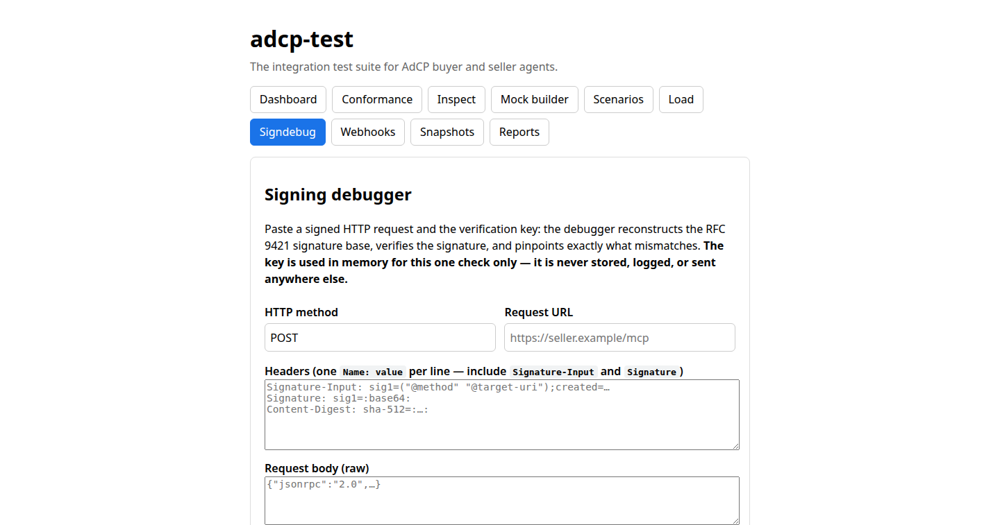
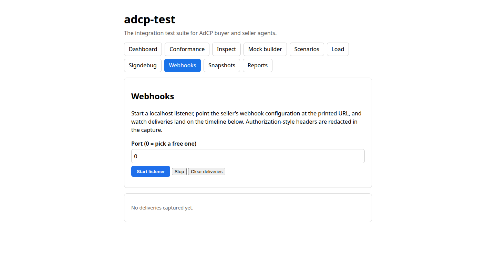
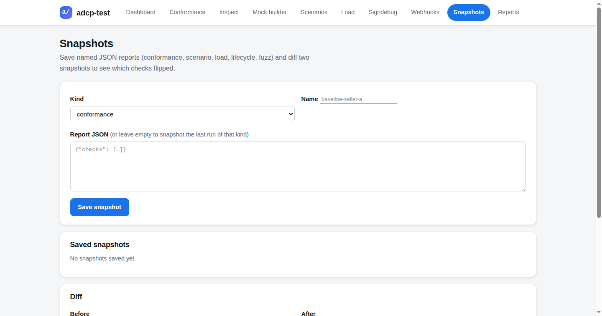
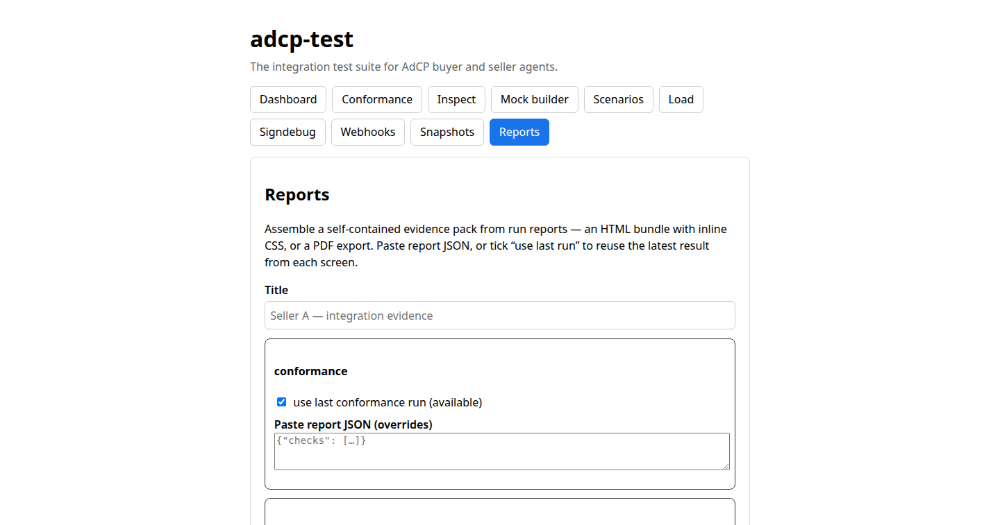

# adcp-test usage guide

The integration test suite for AdCP buyer and seller agents. One local binary,
one web UI, no telemetry, no uploads, no accounts — everything runs on your
machine.

**Supports AdCP 3.1** — the v3 MCP task-based protocol with the RFC 9421
request-signing auth model. The conformance tool surface matches the v3-era task
list (`get_adcp_capabilities`, `get_products`, `list_creative_formats`,
`create_media_buy`, `update_media_buy`, `get_media_buys`, `sync_creatives`,
`sync_catalogs`, `list_creatives`, `get_media_buy_delivery`, `get_signals`).
When the spec moves, `adcp-test specdiff` shows exactly what a new version
changes about your integration — see [specdiff.md](specdiff.md).

## Install

Requirements: **Go 1.27+**.

```sh
git clone https://github.com/sujanchalla0510/adcp-test.git
cd adcp-test
go mod download
go build -o adcp-test ./cmd/adcp-test
./adcp-test            # serves the UI on http://127.0.0.1:18742
```

Or run without building: `go run ./cmd/adcp-test`. Override the port with
`./adcp-test --port 8080`.


## End-to-end in 5 minutes

The repo ships a synthetic mock seller so you can try the whole loop without a
real integration. All fixtures (product ids, budgets, URLs) are invented —
nothing here touches a real seller or real money.

**1. Start the mock seller** (keep this terminal running):

```sh
./adcp-test mock --config examples/mock-seller.yaml
# mock example-seller replay       http://127.0.0.1:8089
```

It speaks JSON-RPC 2.0 (`tools/list`, `tools/call`), advertises the full AdCP
3.1 tool surface, rejects unsigned mutating calls with structured errors, and
drives media buys through a lifecycle state machine.

**2. Run conformance.** In the UI: **Conformance** → enter
`http://127.0.0.1:8089` → **Run conformance**. The 24-check suite probes the
tool surface, input schemas, auth behavior, and error taxonomy. Probes are
read-only — the unsigned and malformed-signature probes use deliberately
invalid arguments, so a conforming seller can never act on them.


Headless, for CI pipelines:

```sh
./adcp-test --ci --target http://127.0.0.1:8089 > conformance.json
echo $?   # 0 when every check passes
```

**3. Inspect the session.** Every run through the web UI is recorded. Open
**Inspect** to walk the request/response timeline with inline schema checks.



**Record / replay:** **Inspect** → start recording, drive traffic through the
built-in proxy, stop — the exchange is saved as a cassette. Replay it later
for deterministic buyer tests without touching the seller.

**4. Build a mock seller.** **Mock builder** → describe fake seller services
as YAML: routes match tool calls by name and argument patterns, and answer
with inline JSON, fixture files, response sequences, or `{{args.*}}`
templates — with latency profiles (fixed / distributed / spiking), fault
injection, and a media-buy lifecycle state machine. **Record mode** proxies a
real seller and generates a reusable mock config from the traffic. YAML
import/export keeps configs in source control.



```sh
# headless equivalent
./adcp-test mock --config integration.yaml
```

**5. Run a scenario pack.** **Scenarios** → set the target → pick a pack card
→ run. Built-in packs: `happy-path-media-buy`, `creative-rejection`,
`cancel-pause`, `budget-limit`, `lifecycle`. Tick **chaos mode** to inject
random faults and latency spikes — the seed in the report replays the exact
run.



```sh
./adcp-test scenario --pack happy-path-media-buy --target http://127.0.0.1:8089
./adcp-test scenario --list   # all built-in packs
```

**6. Run a load test.** **Load** → set concurrency, ramp, and duration →
watch live latency/throughput charts → check the CI thresholds. Load, fuzz,
and chaos targets are localhost-guarded: they refuse non-localhost targets
unless you explicitly opt in.



**7. Debug an RFC 9421 signature.** **Signdebug** → paste the signed request
and the key. The debugger reconstructs the signature base, verifies it, and
pinpoints the exact mismatch — the fastest way to answer "why did the seller
reject my signature?".



**8. Test webhooks.** **Webhooks** → start the localhost listener → point the
seller at the printed URL → watch deliveries land on the timeline.



**9. Snapshot and diff.** **Snapshots** → save any run report as a named
snapshot → diff two snapshots to spot regressions between seller versions.



**10. Export the evidence report.** **Reports** → assemble an HTML/PDF
evidence pack from your run reports — the artifact you hand to a partner or
attach to a launch review.



```sh
./adcp-test report \
  --conformance conformance.json \
  --scenarios scenario.json \
  --title "Example seller — integration evidence" \
  --out evidence.html --pdf evidence.pdf
```

`evidence.html` is self-contained (inline CSS, no external requests);
`evidence.pdf` is the printable export.

## CI usage

```sh
./adcp-test --ci --target https://seller.example/mcp > conformance.json
```

Exit code 0 means every check passed; non-zero means something failed — the
JSON report has the per-check detail. A GitHub Action wrapper is available —
see [ci-action.md](ci-action.md).

## Notes

- **Synthetic data only.** Never point the fuzzer, chaos mode, or load
  generator at a production seller; they are localhost-guarded for a reason.
- **No secrets in configs.** Mock configs and cassettes are checked into
  source control — keep credentials out of them.
- **Research demo, not a certifier.** adcp-test reports functional
  pass/fail; it is not a certification authority and issues no badges.
